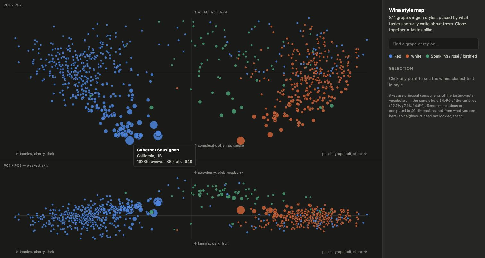

# winemap

A map of wine styles built from what tasters actually write, and a
recommender that runs on it: *if you like X, try Y*.

Each point is a **grape × region** style — Nebbiolo in Piedmont, Riesling in
the Mosel — placed by the vocabulary its reviews use. Wines that get described
the same way land near each other. Click one to see the six closest in style.



## Quickstart

```bash
mkdir -p data                       # 57MB of parquet, not in the repo
for s in train test validation; do
  curl -sL -o data/$s.parquet \
    "https://huggingface.co/api/datasets/spawn99/wine-reviews/parquet/default/$s/0.parquet"
done

python3 winemap.py                  # builds map.json  (~30s)
./serve.sh                          # then open http://localhost:8777/map.html
```

Serve it over HTTP — the page fetches `map.json`, which browsers block on
`file://`. Needs `polars`, `scikit-learn`, `numpy`, `pyarrow`.

| command | what it does |
|---|---|
| `python3 winemap.py` | build `map.json` from `data/*.parquet` |
| `python3 eval.py` | score the recommendations against known substitutions |
| `python3 sweep.py` | sweep the knobs against that eval |
| `python3 winemap.py demo`, `python3 eval.py demo` | self-checks |

## How it works

1. **Pool.** 218k Wine Enthusiast reviews collapse into 811 (variety, province)
   cells of ≥20 reviews. All of a cell's tasting notes become one document.
2. **Filter the vocabulary.** Keep only words that *many* reviewers use
   (`MAX_SHARE`). This is the step that matters — see below.
3. **Project.** TF-IDF → PCA. Not TruncatedSVD: uncentered SVD spends its
   first component on the corpus mean direction, identical for every wine.
4. **Recommend.** Nearest neighbours in the first 40 components. The map plots
   only the first 3, so what you see is a shadow of where the answers come from.

## The one non-obvious step

Wine Enthusiast assigns each region a regular taster, so a reviewer's personal
tics read as regional style. Before filtering, **reviewer identity explained
92% of PC3's spread**, with loadings like `doles`, `luminous`, `chopped`.

The fix needs no hand-written word list: pool one document per taster, and drop
any term whose usage concentrates in a single one. A real descriptor is used by
everyone (`blackberry`, 0.22); a tic is used by one person (`doles`, 0.90).

What survives at the tuned threshold is 76 words that read as a sensory
lexicon — `acidity, cherry, floral, grapefruit, lean, mocha, plum, tannins`.
That is the curated vocabulary you would otherwise type by hand, arrived at
from the data.

## Does it work?

`eval.py` ranks a known substitute (Loire Sauvignon Blanc → Marlborough
Sauvignon Blanc, Rhône Syrah → Australian Shiraz) among all 810 other cells,
over 27 pairs, against baselines that use only metadata.

```
  model                 median rank   29.0 / 811   recall@6 22.2%   MRR 0.154
  same grape            median rank  406.0 / 811   recall@6 14.8%   MRR 0.063
  same region           median rank  409.5 / 811   recall@6  3.7%   MRR 0.039
  random                median rank  322.0 / 811   recall@6  0.0%   MRR 0.006

  model, 16 cross-grape median rank   46.0 / 811   recall@6 25.0%   MRR 0.165
```

It beats "just show the same grape from somewhere else", including on the
cross-grape pairs where that baseline cannot help at all.

**But these numbers are in-sample.** Roughly 80 configurations were scored
against those 27 pairs and the best was kept, so the settings are fitted to the
eval. The direction is trustworthy — the winning knob is monotone with a
plateau, and its vocabulary is independently interpretable — but the magnitude
is optimistic. See `TODO.md`.

## Known limits

- **Agreement, not preference.** The eval encodes conventional wine wisdom,
  which is roughly what tasting notes encode. It cannot tell you whether *you*
  will like the wine. That needs ratings data.
- **Region leaks into style.** ~30% of neighbours share a province. Some of
  that is real (Napa Cabernet and Napa Zinfandel do share ripeness and oak),
  some is vocabulary. They are not separable with this data, because tasters
  are assigned by region.
- **No vintage.** `title` is null on 45% of rows, so vintage is recoverable for
  only ~116k reviews — and vintage is a quality modifier, not a style axis.
- **One critic's palate.** Every review comes from Wine Enthusiast.

## Files

```
winemap.py   pipeline: load → cells → vocabulary → PCA → neighbours → map.json
eval.py      27 substitution pairs, ranked against metadata baselines
sweep.py     knob sweep scored on that eval
map.html     two linked panels (PC1×PC2, PC1×PC3), no dependencies
```

Data: [spawn99/wine-reviews](https://huggingface.co/datasets/spawn99/wine-reviews)
(Wine Enthusiast). `data/` and `map.json` are generated and untracked.
